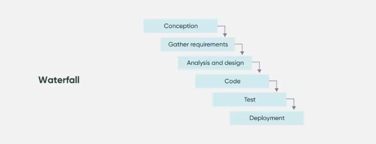

## Git을 활용한 코드 형상관리

- 소프트웨어 개발 과정에서 소프트웨어의 변경 사항을 관리하기 위한 활동
- 프로젝트 리스크를 최소화하고 소프트웨어 품질을 확보할 수 있다 
- Git은 분산 집중형 방식을 활용해서 사용자에게 서버에 저장된 형상들을 저장
  - 중앙 집중형 방식의 단점을 극복 
  - 네트워크 없이도 사용자가 각 PC에서 작업, 서버 복구가 용이 
- 모든 산출물을 대상으로 가능하다 
  

- Waterfall 방식 : 가장 이상적인 개발 프로세스
  - 처음 설계한 완벽한 설계서를 기반으로 한 프로세스
  - 하지만 프로그램 요구사항은 매번 바뀜
  - 버그가 발생하면 이전 프로세스를 돌아봐야 함 

### 중앙 집중형(SVN)

- 각 작업을 서버에 저장하는 방식
- 직관적이고 간편 
- 네트워크가 끊기는 경우 협업이 불가능 